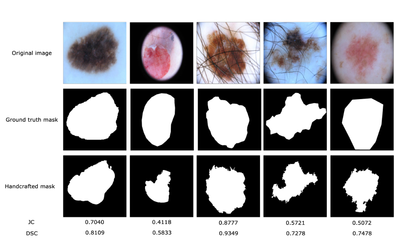

# Skin-Lesion-Segmentation-and-Classification
 Part of my project in 2nd and 3rd Semester of Master's  

 We have applied various traditional Image Processing, Machine Learning and Deep Learning models to segment and classify Skin Lesions. 

    

